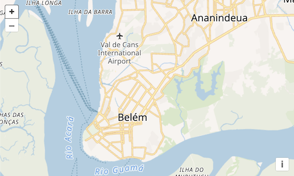

# Making things look bright

Obviously the map we currently have needs some style. Styles for `VectorTile` layers work exactly the same way as for [`Vector`](../vector/style.md) layers. The styles described there will work here as well.

For maps like this, creating data driven styles like for vector layers is straightforward. But vector tiles are also being used for street maps, where styling will usually differ a lot depending on the map's zoom level. In these cases, doing all this by hand may be too time-consuming.

In the history of web mapping, there have been many attempts to create tools and formats for styling maps. The most popular formats were probably SLD and CartoCSS. A graphical tool that comes to mind is Atlas Styler. But none of these formats or tools were really convenient to use.

Mapbox finally came up with Mapbox Studio, a very user-friendly style editor, and the Mapbox Style format. The Mapbox Style format is easy to read and write manually, and supported by a growing number of applications. A graphical Open Source editor, [Maputnik](https://maputnik.github.io/), is available as an independent alternative to Mapbox Studio for creating and modifying Mapbox Style files.

## Using a Mapbox Style definition

With the additional [ol-mapbox-style](https://npmjs.com/package/ol-mapbox-style/) library, there are several ways to use vector tile layers with Mapbox styles in OpenLayers. The easiest is the `MapboxVector` layer from the `ol-mapbox-style` import. It is configured with a url that points to a Mapbox Style document. Let's try it out.

First, add the required import:

[import:'import'](../../../src/en/examples/vectortile/bright.js)

The tile dataset we are going to use is https://tiles.openfreemap.org/styles/bright. Alternatively, if you have a Mapbox account, you could use the ancestor of that map from Mapbox (see comments in the code below).

[import:'layer'](../../../src/en/examples/vectortile/bright.js)

The above code replaces the `VectorTileLayer` from the previous step. When everything works as expected, we can finally enjoy a nice looking world map, and zoom in to Belém!



## Build a complete map from a Mapbox Style definition

The Mapbox Style format was not just made for styling vector data. It was made to describe an entire map, with all its sources and layers, and its initial view configuration (e.g. center and zoom level).

With `ol-mapbox-style`'s `apply()` function, it is also possible to create a whole map from a Mapbox Style. If you want to try that, you could replace the whole code in `main.js` with this:
```js
import {apply} from 'ol-mapbox-style';
apply('map-container', 'https://tiles.openfreemap.org/styles/bright');
```
After trying this, switch back to the previous code, as we will be looking into how to interact with a vector tile map.
