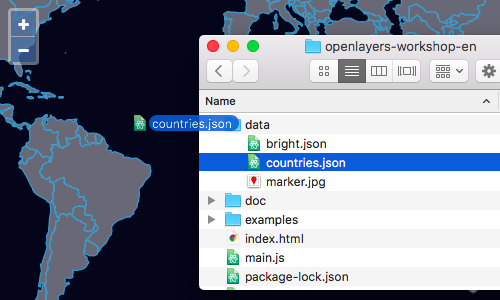

# Glisser-déposer

Pour notre éditeur d'objets géographiques, nous voulons que les utilisateurs puissent importer leurs propres données pour éditer. Nous utiliserons l'interaction `DragAndDrop` pour cela. Comme auparavant, nous allons rester attacher au format GeoJSON pour parser les objets géographiques, mais l'interaction peut être configurée pour fonctionner avec n'importe quel nombre de formats de sérialisation d'objets géographiques.

Importer l'interaction de glisser-déposer dans votre `main.js`:

[import:'import'](../../../src/en/examples/vector/drag-n-drop.js)

Ensuite, nous allons créer une source vecteur sans données initiales. Au lieu de charger des données à partir d'un emplacement distant comme dans l'exemple précédent, cette source stockera les objets géographiques que l'utilisateur glisse et dépose sur la carte.

[import:'source'](../../../src/en/examples/vector/drag-n-drop.js)

Maintenant, supprimez la liste des `layers` anciennes de la carte, créez une nouvelle couche avec notre source vecteur vide et ajoutez-la à la carte.

[import:'layers'](../../../src/en/examples/vector/drag-n-drop.js)

Enfin, nous allons créer une interaction glisser-déposer, la configurer pour qu'elle fonctionne avec notre source vecteur et l'ajouter à la carte:

[import:'interaction'](../../../src/en/examples/vector/drag-n-drop.js)

Maintenant, vous devriez pouvoir faire un glisser-déposer de fichiers GeoJSON sur [la carte]({{book.workshopUrl}}/) et les voir rendus.

