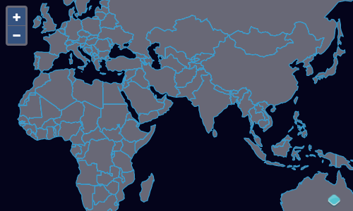

# Faire le rendu d'un GeoJSON

Avant d'entrer dans l'édition, nous allons jeter un oeil au rendu d'objets géographiques de base avec une source et une couche de vecteur. L'atelier comprend un fichier GeoJSON `countries.json` dans le répertoire `data`. Nous commencerons simplement en chargeant ces données et en les rendant sur une carte.

Tout d'abord, éditez votre `index.html` afin que nous soyons prêts à afficher une carte de page complète:

[import](../../../src/en/examples/vector/geojson.html)

Maintenant, nous importerons les trois ingrédients importants pour travailler avec des données vecteur:

 * Un format pour lire et écrire des données sérialisées (GeoJSON dans ce cas)
 * Une source vecteur pour récupérer les données et gérer un index spatial des objets géographiques
 * Une couche vecteur pour faire le rendu des objets géographiques sur la carte

Mettez à jour votre `main.js` pour charger et rendre un fichier local contenant les objets géographiques GeoJSON:

[import](../../../src/en/examples/vector/geojson.js)

Vous devriez maintenant pouvoir voir une carte avec les frontières des pays à {{book.workshopUrl}}/.

Comme nous allons recharger la page très souvent, il serait bon que la carte reste là où nous l'avons laissé après un rechargement. Nous pouvons introduire le [package `ol-hashed`](https://www.npmjs.com/package/ol-hashed) pour que cela fonctionne. Normalement, nous l'installerions d'abord (bien qu'il soit déjà inclus dans les dépendances du workshop):

    npm install --save ol-hashed

Ensuite, dans notre `main.js`, nous importerons la fonction exportée par le package:

[import:'import'](../../../src/en/examples/vector/sync.js)

Et maintenant, nous pouvons appeler cette fonction avec notre carte:

[import:'sync'](../../../src/en/examples/vector/sync.js)

Maintenant, vous devriez voir que le rechargement de page conserve la vue de la carte stable. Et le bouton arrière fonctionne comme vous pouvez l'attendre.
