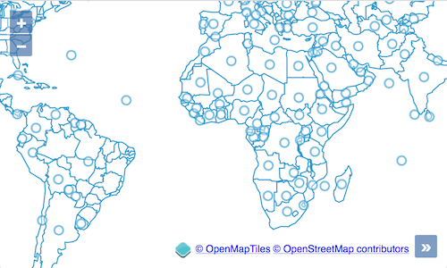

# La couche VectorTile

Nous savons maintenant comment charger des images tuilées, et nous avons vu différentes façons de charger et de faire le rendu des données vecteur. Mais que se passerait-il si nous pouvions avoir des tuiles qui sont rapides à transférer sur le navigateur et qui peuvent être stylées à la volée? Eh bien, c'est ce pourquoi les tuiles vecteur ont été faites pour. OpenLayers supporte les tuiles vecteur via la couche `VectorTile`.

## Une carte du monde rendue depuis des données vecteur

Nous allons commencer avec le même markup dans `index.html` que dans l'exercice [Les bases](../basics/map.md).

[import](../../../src/en/examples/vectortile/map.html)

Comme d'habitude, nous sauvegardons `index.html` dans la racine de notre dossier workshop.

Pour l'application, nous allons commencer par un nouveau `main.js` tout frais dans la racine du dossier de workshop et ajouter les imports requis:

[import:'imports'](../../../src/en/examples/vectortile/map.js)

La source de données que nous allons utiliser nécessite une clé d'accès. Veuillez lire les termes à https://openmaptiles.com/hosting/, où vous pouvez également obtenir votre propre clé. Le code ci-dessous attribue la clé à une constante que nous allons utiliser plus tard:

```js
// See https://openmaptiles.com/hosting/ for terms and access key
const key = '<your-access-key-here>';
```

La carte que nous allons créer ici est la même que celle utilisée dans les exercices précédents:

[import:'map'](../../../src/en/examples/vectortile/map.js)

 Le type de couche que nous allons utiliser maintenant est `VectorTileLayer`, avec une ` VectorTileSource`:

[import:'layer'](../../../src/en/examples/vectortile/map.js)

Notre source de données fournit uniquement des niveaux de zoom `0` à `14`, donc nous devons configurer une grille de tuiles personnalisée. Les couches de tuiles vecteur sont généralement optimisées pour une taille de tuiles de 512 pixels, que nous avons également configurée avec la grille de tuiles. Le fournisseur de données nous demande également d'afficher certaines `attributions`.

Comme vous pouvez le voir, une `VectorTileSource` est configurée avec un `format` et une `url`, tout comme une `VectorLayer`. Le format `MVT` parse les tuiles vecteur de type Mapbox (MVT comme Mapbox Vector Tiles).

L'exemple fonctionnel sur {{book.workshopUrl}}/ montre une carte vecteur non stylée comme ceci:


